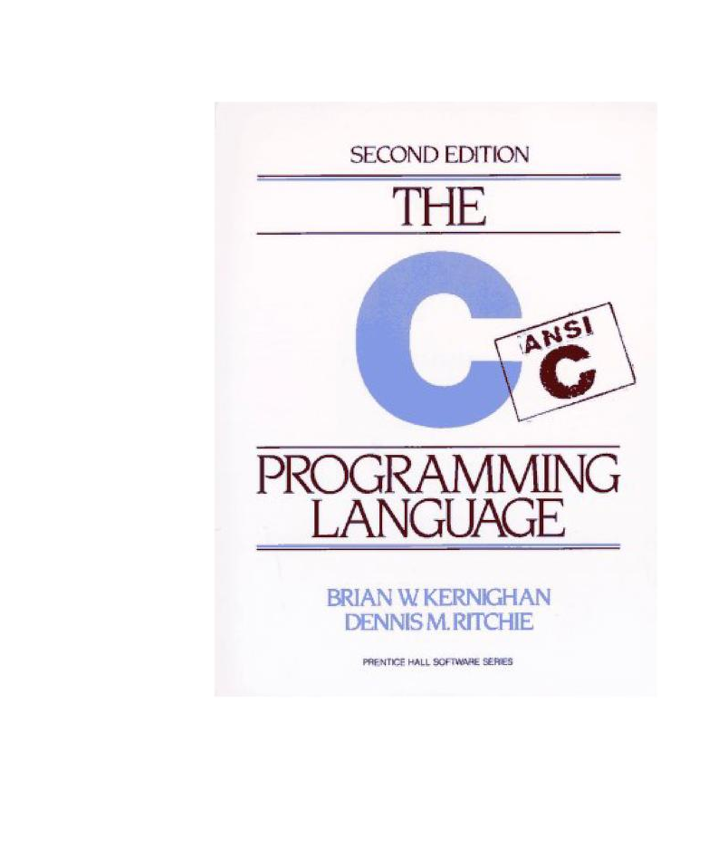

## QUESTIONS

<b>Chapter-1</b>

<ol>
<li>Run the ``hello, world'' program on your system. Experiment with leaving out parts of the program, to see what error messages you get.</li>
<li>Experiment to find out what happens when prints's argument string contains \c, where c is some character not listed above.</li>
<li>Modify the temperature conversion program to print a heading above the table.</li>
<li>Write a program to print the corresponding Celsius to Fahrenheit table.</li>
<li>Modify the temperature conversion program to print the table in reverse order, that is, from 300 degrees to 0.</li>
<li>Verify that the expression getchar() != EOF is 0 or 1</li>
<li>Write a program to print the value of EOF.</li>
<li>Write a program to count blanks, tabs, and newlines.</li>
<li>Write a program to copy its input to its output, replacing each string of one or more blanks by a single blank.</li>
<li>Write a program to copy its input to its output, replacing each tab by \t, each backspace by \b, and each backslash by \\. This makes tabs and backspaces visible in an unambiguous way.</li>
<li>How would you test the word count program? What kinds of input are most likely to uncover bugs if there are any?</li>
<li>Write a program that prints its input one word per line.</li>
<li>Write a program to print a histogram of the lengths of words in its input. It is easy to draw the histogram with the bars horizontal; a vertical orientation is more challenging.</li>
<li>Write a program to print a histogram of the frequencies of different characters in its input.</li>
<li>Rewrite the temperature conversion program of Section 1.2 to use a function for conversion.</li>
<li>Revise the main routine of the longest-line program so it will correctly print the length of arbitary lon ginput lines, and as much as possible of the text.</li>
<li>Write a program to print all input lines that are longer than 80 characters.</li>
</ol>

<b>Chapter-2</b>

<ol>
<li>Write a program to determine the ranges of char, short, int, and long variables, both signed and unsigned, by printing appropriate values from standard headers and by direct computation. Harder if you compute them: determine the ranges of the various floating-point types.  </li>
<li>Write a loop equivalent to the for loop above without using && or ||.</li>
<li>Write a function htoi(s), which converts a string of hexadecimal digits (including an optional 0x or 0X) into its equivalent integer value. The allowable digits are 0 through 9, a through f, and A through F.  </li>
<li>Write an alternative version of squeeze(s1,s2) that deletes each character in s1 that matches any character in the string s2.  </li>
<li>Write the function any(s1,s2), which returns the first location in a string s1 where any character from the string s2 occurs, or -1 if s1 contains no characters from s2. (The standard library function strpbrk does the same job but returns a pointer to the location.)  </li>
<li>Write a function setbits(x,p,n,y) that returns x with the n bits that begin at position p set to the rightmost n bits of y, leaving the other bits unchanged.  </li>
<li>Write a function invert(x,p,n) that returns x with the n bits that begin at position p inverted (i.e., 1 changed into 0 and vice versa), leaving the others unchanged.  </li>
<li>Write a function rightrot(x,n) that returns the value of the integer x rotated to the right by n positions.  </li>
<li>In a two's complement number system, x &= (x-1) deletes the rightmost 1-bit in x. Explain why. Use this observation to write a faster version of bitcount.  </li>
<li>Rewrite the function lower, which converts upper case letters to lower case, with a conditional expression instead of if-else. </li>
<li>Write a program to remove trailing blanks and tabs from each line of input, and to delete entirely blank lines.  </li>
<li>Write a function reverse(s) that reverses the character string s. Use it to write a program that reverses its input a line at a time. </li>
<li>Write a program detab that replaces tabs in the input with the proper number of blanks to space to the next tab stop. Assume a fixed set of tab stops, say every n columns. Should n be a variable or a symbolic parameter? </li>
</ol>

<!--
#### thoughts
- make vertical bar for 13 and 14
- need to improve 16
-->

> [!Warning]
> May contains errors or be incorrect
